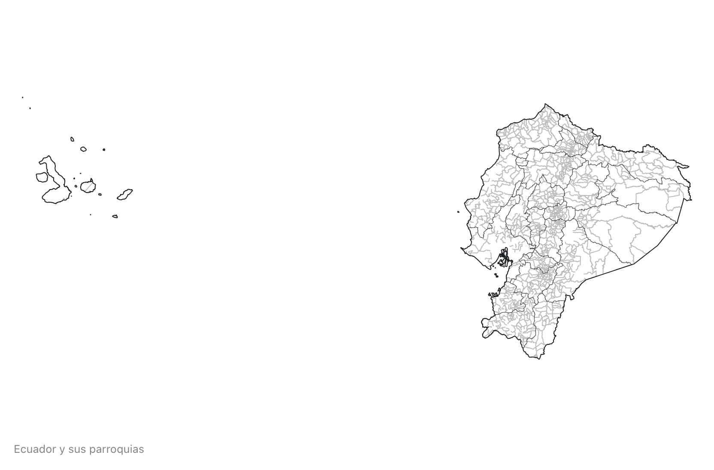
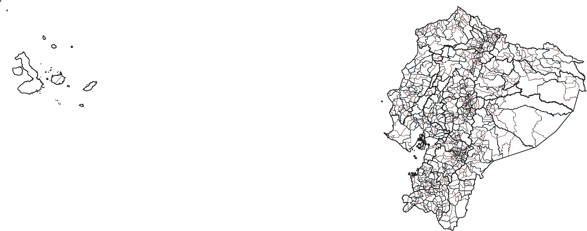
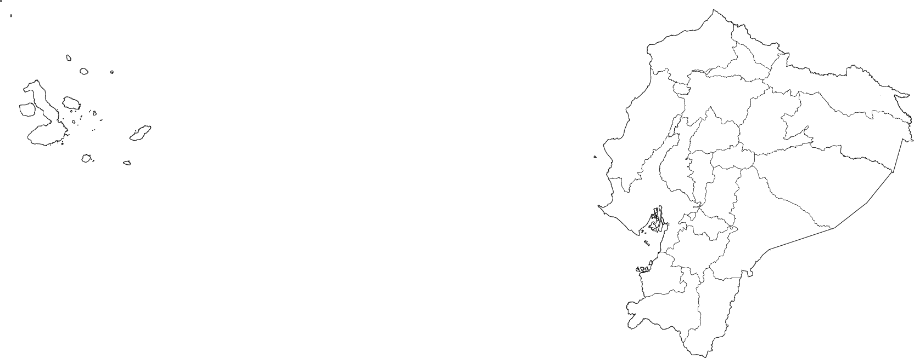

# Ecuador Atlas TopoJSON

This repository provides a convenient redistribution of the [Ecuador cartographic boundary shapefiles](https://www.ecuadorencifras.gob.ec/documentos/web-inec/Geografia_Estadistica/Micrositio_geoportal/index.html), 2015 edition as vector data. 

To align the names of subnational jurisdictions in Ecuador, four levels have been set:

* `level1`: country
* `level2`: provinces
* `level3`: cantons
* `level4`: parishes

### Usage

You can use the geojson and topojson files in your map on a webpage.

To visualize with d3:

```
d3
    .geoIdentity()
    .reflectY(true)
    .fitSize([width, height], features)
```

Or using Plot in observablehq, 
see an example [here](https://observablehq.com/d/5c8d5f19f2c4dfef)

## Generating the files

Clone or download the repo and start a terminal. Then run `npm run prepublishOnly` to transform the downloaded zip files into topojson files.

If you need to make further adjustments (projection, simplification, quantization) you can change the `prepublish` config file and run `npm run prepublishOnly` again.

Note: Use the identity projection to visualize the map. 

### Reference

<a href="#simplification" name="simplification">#</a> <i>simplification</i>

Removes points to reduce the file size. Set to 3% by default.

<a href="#quantization" name="quantization">#</a> <i>quantization</i>

Removes information by reducing the precision of each coordinate. Set to `1e5` by default.

## File Reference
<a href="#ecuador-transverse_mercator-50k.json" name="ecuador-transverse_mercator-50k.json.json">#</a> <b>ecuador-transverse_mercator-50k.json</b> · [Download](https://cdn.jsdelivr.net/npm/ec-atlas@0.0.6/ecuador-transverse_mercator-50k.json "Source")

A [TopoJSON file](https://github.com/topojson/topojson-specification/blob/master/README.md#21-topology-objects) containing 4 levels of geometry. The geometry is quantized and simplified and [projected](https://epsg.io/32717). 

<a href="#parishes" name="parishes">#</a> *ec*.objects.<b>level4</b>



Each parish has two properties:

* *parish.id* - the six-digit [DPA_PARROQ code](https://www.ecuadorencifras.gob.ec/documentos/web-inec/Poblacion_y_Demografia/CPV_aplicativos/modulo_cpv/dpa_.xls), such as `"010152"`
* *parish.properties.name* - the district name, such as `"CUMBE"`

The first two digits of the parish DPA_PARROQ code is the province code.

<a href="#cantons" name="cantons">#</a> *ec*.objects.<b>level3</b>



Each canton has two properties:

* *canton.id* - the four-digit [canton code](https://www.ecuadorencifras.gob.ec/documentos/web-inec/Poblacion_y_Demografia/CPV_aplicativos/modulo_cpv/dpa_.xls), such as `"0102"`
* *canton.properties.name* - the province name, such as `"GIRON"`

<a href="#provinces" name="provinces">#</a> *ec*.objects.<b>provinces</b>



The provinces has two properties:

* *province.id* - the string `"01"`
* *province.properties.name* - the string `"AZUAY"`

### Inspiration

The original idea and implementation comes from Mike Bostock’s [us-atlas](https://github.com/topojson/us-atlas) and [world-atlas](https://github.com/topojson/world-atlas).