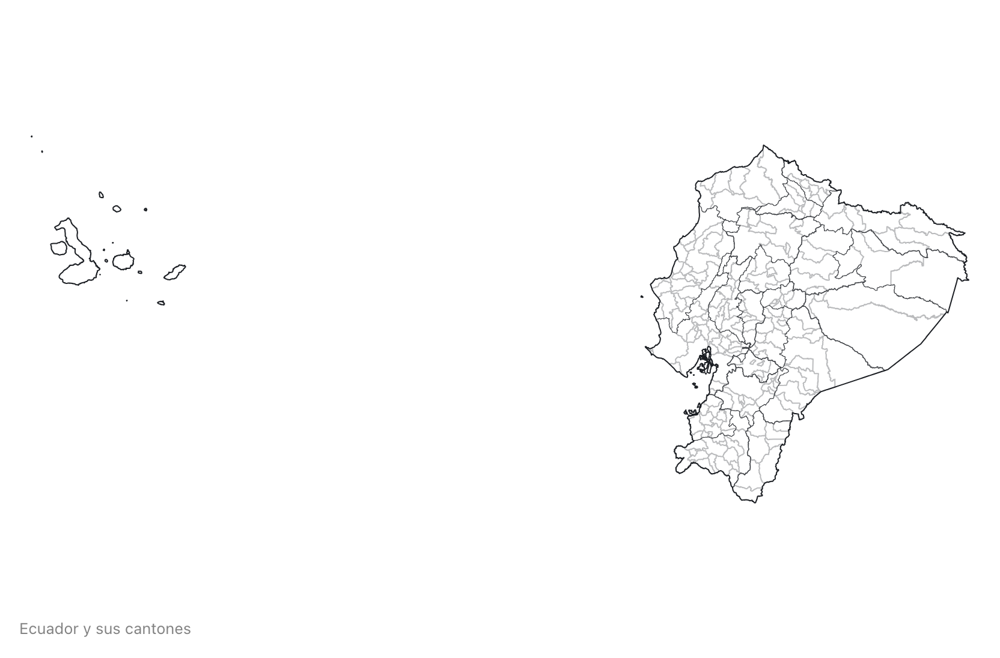
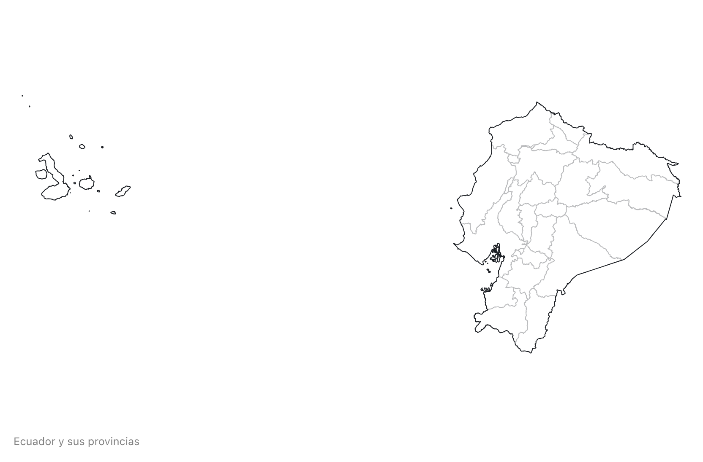

# Ecuador Atlas TopoJSON

This repository provides a convenient redistribution of the [Ecuador cartographic boundary shapefiles](https://www.ecuadorencifras.gob.ec/documentos/web-inec/Geografia_Estadistica/Micrositio_geoportal/index.html), 2015 edition as vector data. Split SHP.zip into 4 more zip files: nxparroquias.zip, nxcantones.zip, nxprovincias.zip and periferia.zip.

### Usage

You can use the geojson and topojson files in your map on a webpage.

## Generating the files

Clone or download the repo and start a terminal. Since there isn't a web service to directly Download the vector files, download them manually and create and move them into the `build` folder. Then run `npm run prepublishOnly` to transform the zip files into topojson files.

If you need to make further adjustments (projection, simplification, quantization) you can change the `prepublish` config file and run `npm run prepublishOnly` again.

> Temporarily you can reduce the size of these topojson files even more using [mapshaper](https://mapshaper.org/). For these project i simplify to 6%.

### Reference

<a href="#simplification" name="simplification">#</a> <i>simplification</i>

Removes points to reduce the file size. Set to `1e-7` by default.

<a href="#quantization" name="quantization">#</a> <i>quantization</i>

Removes information by reducing the precision of each coordinate. Set to `1e5` by default.

## File Reference

<a href="#parishes-50k.json" name="parishes-50k.json">#</a> <b>parishes-50k.json</b> · [Download](https://cdn.jsdelivr.net/npm/ec-atlas@0.0.1/parishes-50k.json "Source")

A [TopoJSON file](https://github.com/topojson/topojson-specification/blob/master/README.md#21-topology-objects) containing three objects: parishes, cantons and provinces corresponding to [Ecuador cartographic boundary shapefiles](https://www.ecuadorencifras.gob.ec/documentos/web-inec/Geografia_Estadistica/Micrositio_geoportal/index.html).
The geometry is quantized and simplified, but not projected.

<a href="#cantons-50k.json" name="cantons-50k.json">#</a> <b>cantons-50k.json</b> · [Download](https://cdn.jsdelivr.net/npm/ec-atlas@0.0.1/cantons-50k.json "Source")

A [TopoJSON file](https://github.com/topojson/topojson-specification/blob/master/README.md#21-topology-objects) containing the geometry collections <i>cantons</i> and <i>provinces</i>. The geometry is quantized and simplified, but not projected. 

<a href="#provinces-50k.json" name="provinces-50k.json">#</a> <b>provinces-50k.json</b> · [Download](https://cdn.jsdelivr.net/npm/ec-atlas@0.0.1/provinces-50k.json "Source")

A [TopoJSON file](https://github.com/topojson/topojson-specification/blob/master/README.md#21-topology-objects) containing the geometry collection <i>provinces</i>. The geometry is quantized and simplified, but not projected. 

<a href="#parishes" name="parishes">#</a> *pe*.objects.<b>parishes</b>

Each parish has two properties:

* *parish.id* - the six-digit [DPA_PARROQ code](https://www.ecuadorencifras.gob.ec/documentos/web-inec/Poblacion_y_Demografia/CPV_aplicativos/modulo_cpv/dpa_.xls), such as `"010152"`
* *parish.properties.name* - the district name, such as `"CUMBE"`

The first two digits of the parish DPA_PARROQ code is the province code.

<a href="#cantons" name="cantons">#</a> *pe*.objects.<b>cantons</b>

Each province has two properties:

* *canton.id* - the four-digit [canton code](https://www.ecuadorencifras.gob.ec/documentos/web-inec/Poblacion_y_Demografia/CPV_aplicativos/modulo_cpv/dpa_.xls), such as `"0102"`
* *canton.properties.name* - the province name, such as `"GIRON"`

<a href="#provinces" name="provinces">#</a> *pe*.objects.<b>provinces</b>

The provinces has two properties:

* *province.id* - the string `"01"`
* *province.name* - the string `"AZUAY"`

### Inspiration

The original idea and implementation comes from Mike Bostock’s [us-atlas](https://github.com/topojson/us-atlas) and [world-atlas](https://github.com/topojson/world-atlas).